# Annado Mobile (Annado Obsidian Plugin)

> **Status: retired (September 2026).** This plugin is superseded by the Annado iOS app
> and gets no further development. It still works as released and reads the same
> `shared.json` settings file, but new format features — `@remind`, the current marker
> order — are only implemented in the desktop and iOS apps. Bug reports are welcome; new
> features will not be added here.

**Your Obsidian vault as a friendly task manager on your phone.**

Annado Mobile turns the Markdown checkboxes already in your notes into a fast,
thumb-friendly task app: Inbox, Today, Upcoming, projects, people and tags — with swipe
gestures, quick capture and search. Your tasks never leave your notes: everything is
plain text in your own files, synced however your vault syncs.

It's the mobile companion to the [Annado desktop app](https://github.com/ABeehive/Annado),
and it also works completely on its own, no desktop app required. It also works on the desktop but is designed with mobile and tablet in mind. 

<p align="center">
  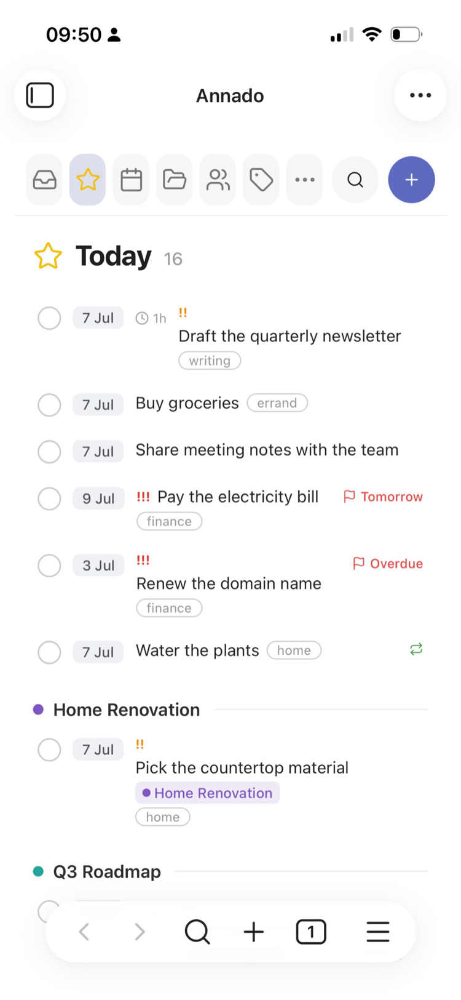
</p>

## Why you might like it

- **Everything stays in your notes.** Tasks are ordinary `- [ ]` checkbox lines. No
  database, no account, no lock-in — turn the plugin off and your tasks are still right
  there in your Markdown.
- **Made for your thumb.** Swipe right to complete, swipe left to reschedule or delete.
  A big `+` for quick capture. A built-in tap calendar for picking dates (mobile
  Obsidian can't show the native iOS date picker — so we bring our own).
- **Careful with your files.** Completing a task changes only the checkbox and adds a
  completion date; everything else on the line stays exactly as you wrote it — including
  things the plugin doesn't recognize. That promise is guarded by a test suite of 240+
  cases.
- **Plays nicely with other plugins.** It reads three task styles — Annado
  (`@when(...)`), Obsidian Tasks (emoji) and Dataview (`[key:: value]`) — and writes
  whichever one you choose in settings.

## A tour

| Today | Upcoming | Inbox |
|:--:|:--:|:--:|
|  | 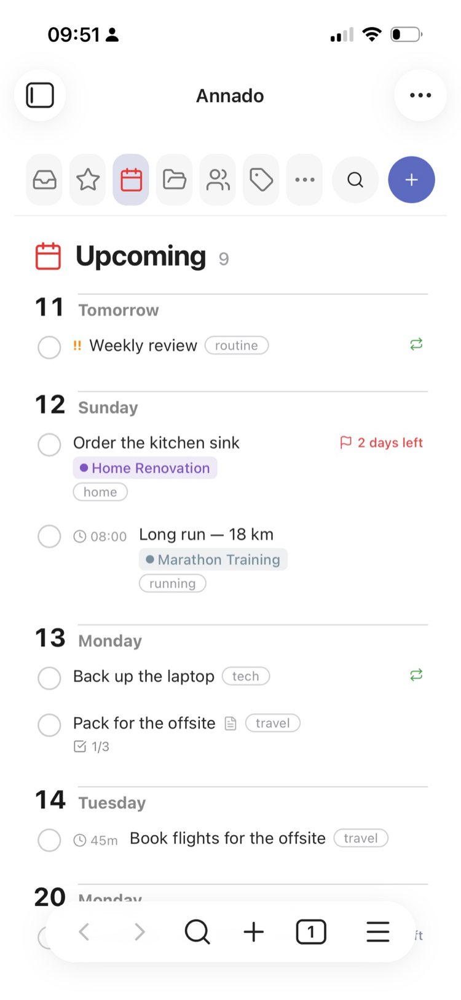 | 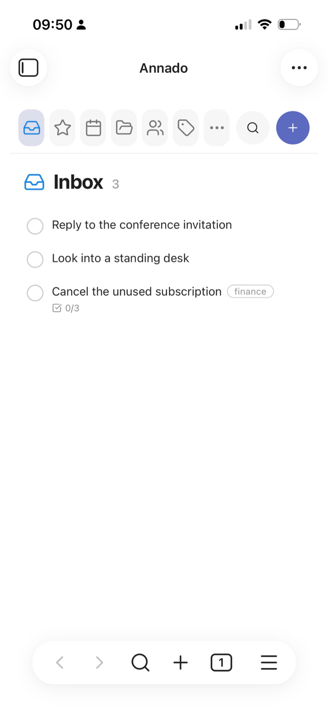 |
| Today's plan plus anything overdue, with deadline flags. | The days ahead, grouped per day. | Unscheduled captures waiting for a home. |

| Projects | People | Tags |
|:--:|:--:|:--:|
| 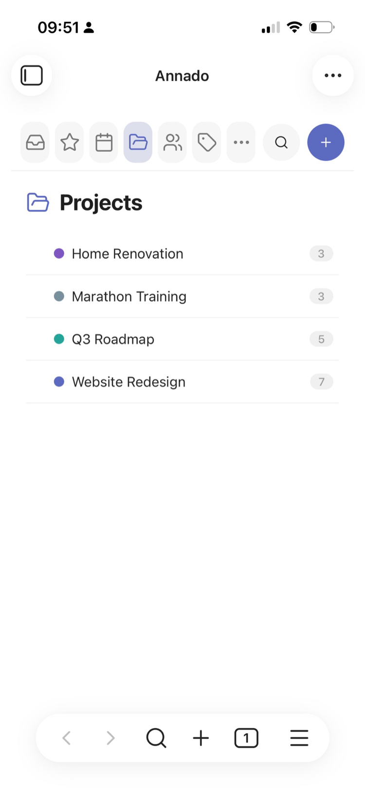 | 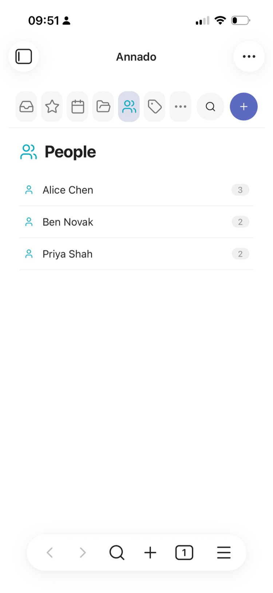 | 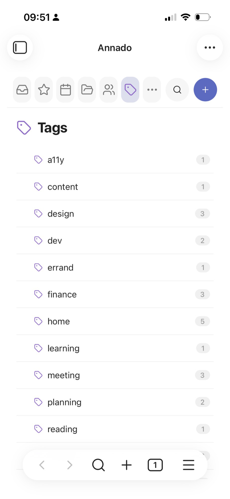 |
| Your project notes, with their own colors. | Tasks per `[[Person]]` you mention. | Every `#tag`, nested tags included — each in its own color. |

Tap any of them to drill in:

| Inside a project | Inside a person | Inside a tag |
|:--:|:--:|:--:|
| 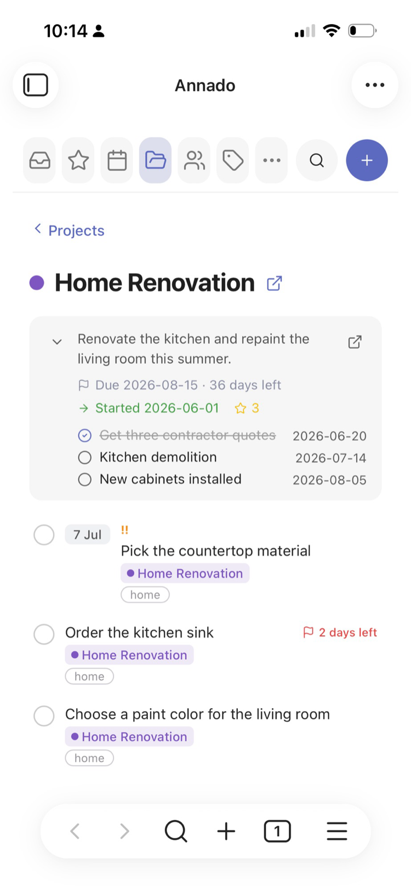 | 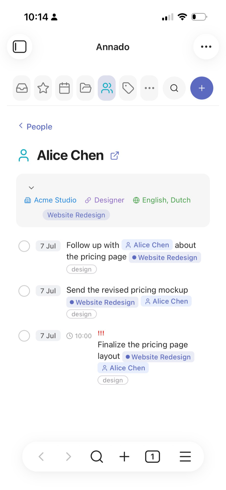 | 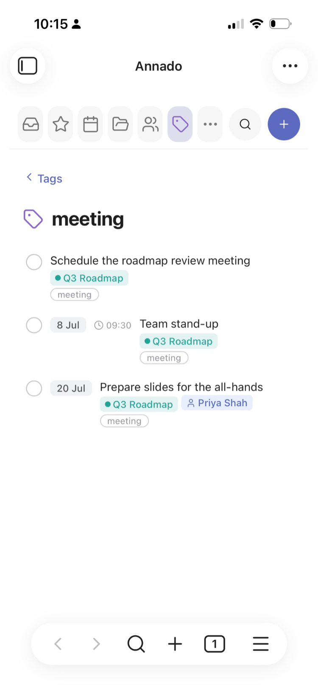 |
| Description, dates and milestones from the project note, above its tasks. | Organisation, role and languages from the person note. | Everything carrying the tag, in one list — tap the tag icon to change its color. |

| Anytime | Someday | Logbook |
|:--:|:--:|:--:|
| 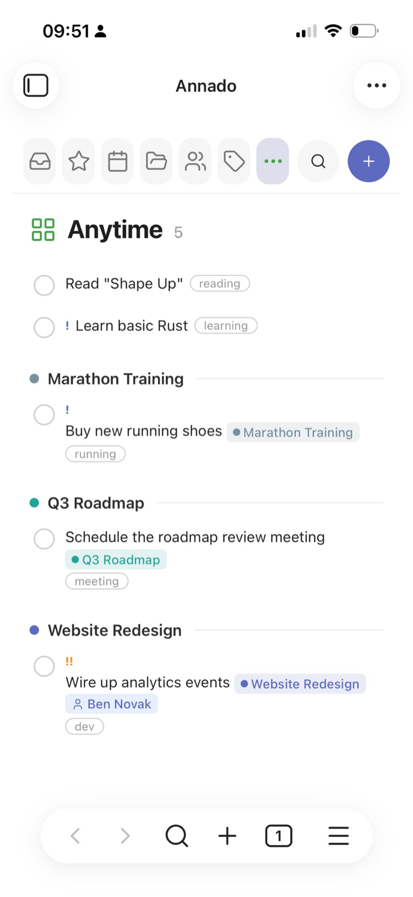 | 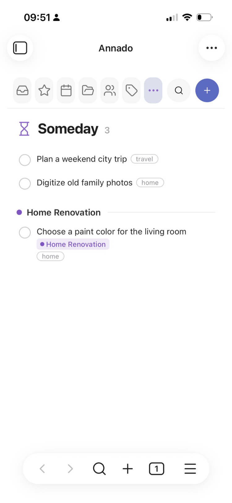 | 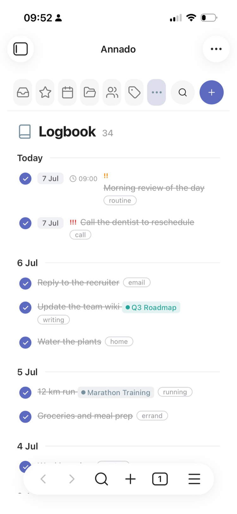 |
| Ready whenever you are. | Ideas for later. | What you finished, day by day. |

Anytime, Someday and Logbook live behind the **⋯ More** button:

| More views | Quick Find |
|:--:|:--:|
| 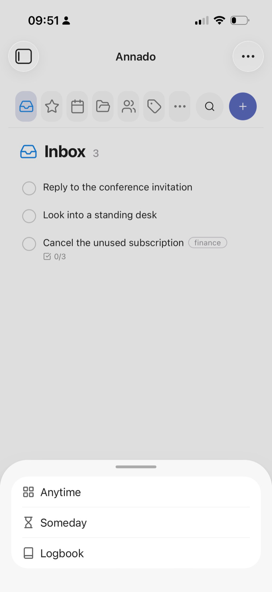 | 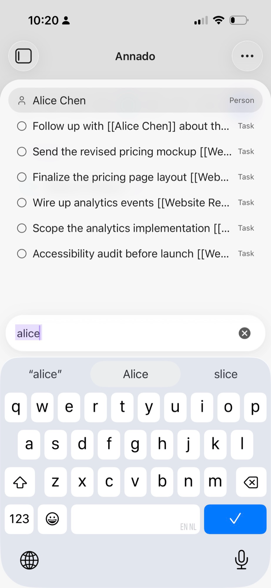 |
| One tap away. | Type a few letters and jump to a task — or straight to a person, project or tag. |

## Adding and editing

| New task | Edit task | Delete asks first |
|:--:|:--:|:--:|
| 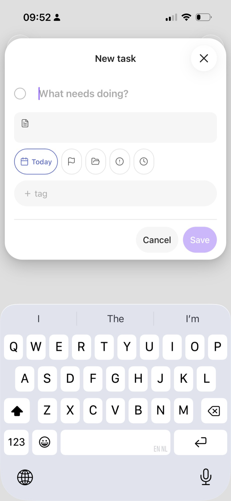 | 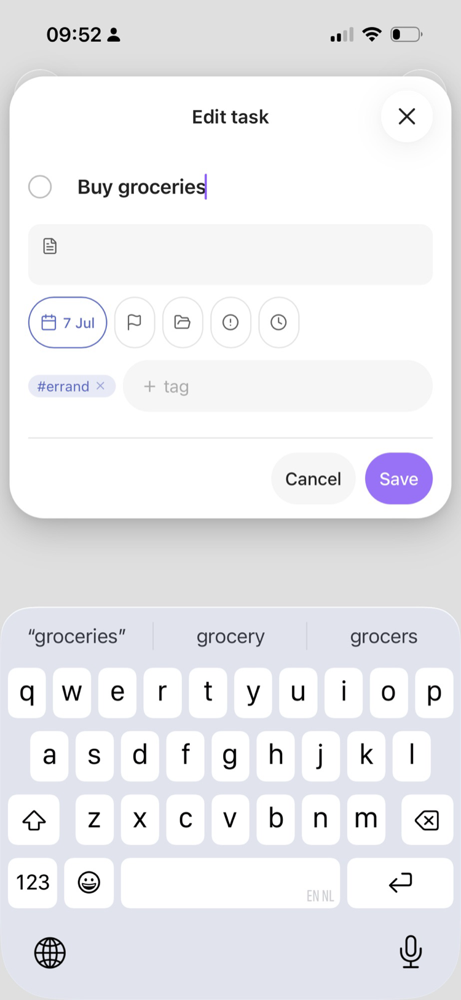 | 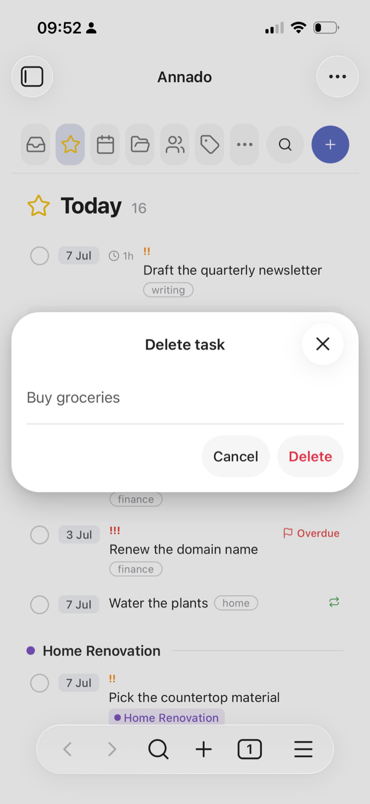 |

And the two swipes you'll use all day:

| Swipe right to complete | Swipe left to reschedule or delete |
|:--:|:--:|
| 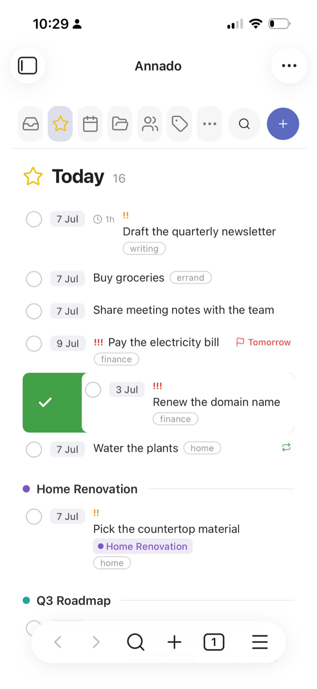 | 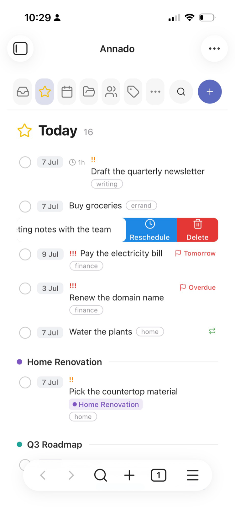 |

- **Add** — tap `+`. Set a date, deadline, project, priority, duration and tags from the
  icon row; tags autocomplete. The sheet is context-aware: add from a project, person or
  tag view and it's pre-filled. New tasks land in today's daily note.
- **Edit** — open a task and tap the pencil to change anything.
- **Complete** — tap the circle. Recurring tasks (`every week`, `every 2 days when done`,
  …) automatically schedule their next occurrence.
- **Reschedule** — tap a task's date pill for Today / Tomorrow / This weekend / Next
  week, or pick any date on the tap calendar.
- **Open in Obsidian** — jump straight to the task's line in your note.

## Follows your theme

The plugin is styled with Obsidian's own theme variables, so it adapts to light mode,
dark mode and community themes automatically:

| Today | Inbox | Inside a person |
|:--:|:--:|:--:|
| 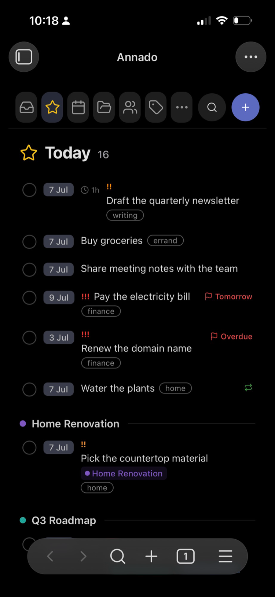 | 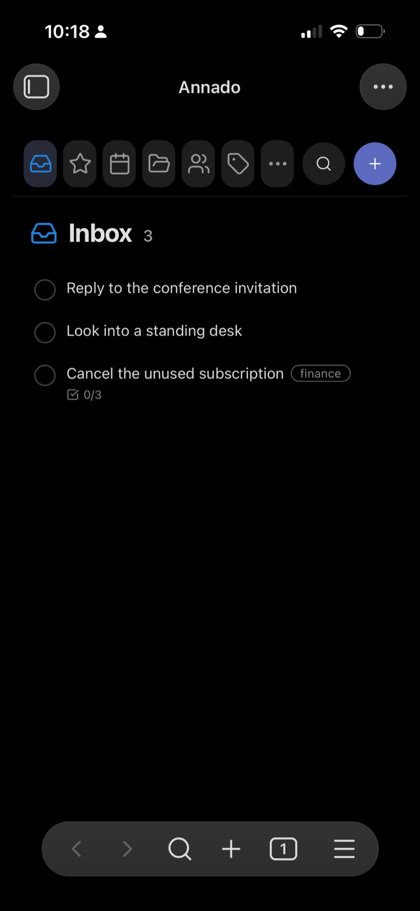 | 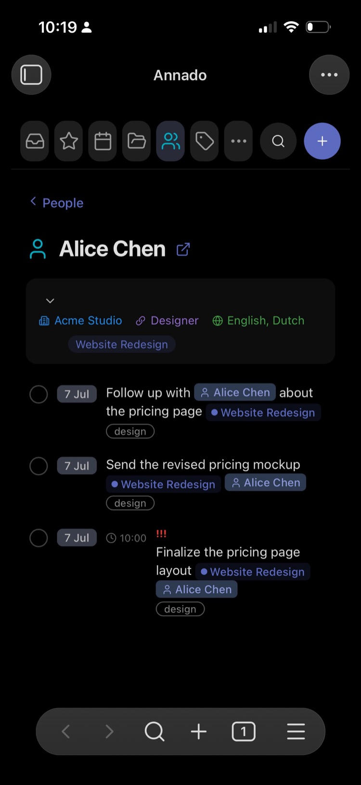 |

## How your tasks are stored

A task is one checkbox line in any note, with optional details inline:

```markdown
- [ ] Order the kitchen sink @when(2026-07-12) @due(2026-07-14) !! #home [[Home Renovation]]
```

- The date it's planned for (`@when`), a deadline (`@due`), priority (`!` to `!!!`),
  a duration, `#tags`, and `[[Project]]` or `[[Person]]` links.
- Indented lines below a task become its **notes**; indented checkboxes become its
  **checklist**.
- Projects and people are regular notes in folders you point the plugin at
  (`Projects/`, `Persons/` — configurable). A project's tasks can live in its own note
  or reference it with a `[[wikilink]]` from anywhere.
- Prefer the [Obsidian Tasks](https://publish.obsidian.md/tasks/) emoji style or
  Dataview fields? The plugin reads all three styles and writes the one you pick.
- A note's frontmatter `tags` can flow down onto its tasks too — turn on **Show
  frontmatter tags on tasks** in Settings (a single note can override with
  `annado_inherit_tags: true` or `false` in its own frontmatter). Inherited tags show as
  dashed chips on the task, so you can tell them apart from tags written on the line
  itself.

## Using it with the Annado desktop app

[Annado](https://github.com/ABeehive/Annado) is a task manager for your Mac built on the
same idea — your Obsidian / Markdown files are the database. Run both and your phone and
Mac stay in sync through the vault itself: same files, same format, no extra service.

When the desktop app's *"This vault is used with the Obsidian plugin"* toggle is on, it
shares a small `shared.json` with the plugin: project **and tag** colors, excluded tags
and the frontmatter-tag-inheritance toggle all sync both ways, and the task format, the
import marker and excluded paths follow the desktop (they show as locked in the plugin's
settings). Without the desktop app the plugin simply uses its own settings and picks
stable colors per name — nothing breaks.

On a **phone**, sync services don't carry `shared.json` itself (Obsidian Sync only syncs
a plugin's code and settings files), so the plugin tucks a mirror of it into its own
settings — which do sync. Colors and parser settings just work on mobile, and a color
you pick on your phone travels back by way of the desktop: it's applied the next time
Obsidian is open on the machine that runs the Annado app.

Curious exactly what the desktop app adds? There's a
[full comparison](#compared-to-the-annado-desktop-app) at the bottom of this page.

## Install

**Community plugins (once accepted):** Settings → Community plugins → Browse → search
for *Annado Mobile*.

**Manual:** download `main.js`, `manifest.json` and `styles.css` from a
[release](https://github.com/ABeehive/annado-obsidian-plugin/releases) and copy them
into `<vault>/.obsidian/plugins/annado-mobile/`. Let the vault sync to your device, then
enable **Annado Mobile** under Settings → Community plugins.

## Settings

| | |
|:--:|:--:|
| 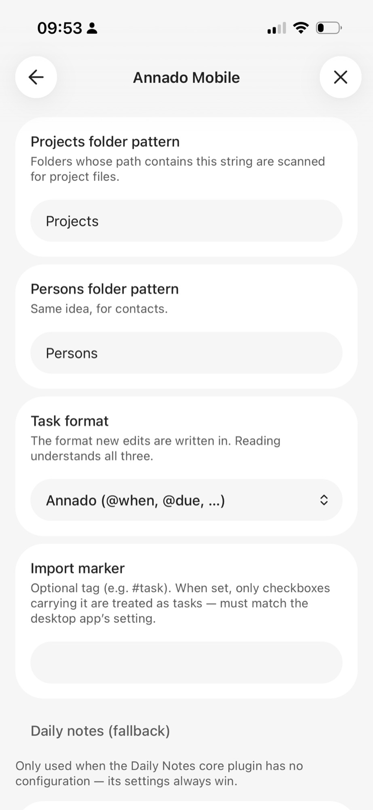 | 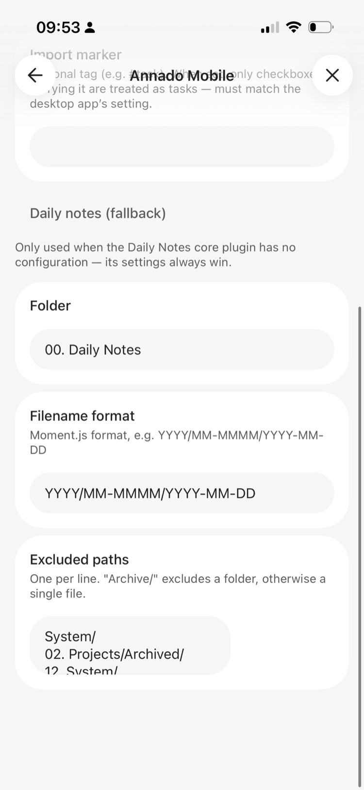 |

- **Projects / Persons folder pattern** — which folders hold your project and people
  notes.
- **Task format** — the style new edits are written in (reading understands all three).
- **Import marker** — optional: only treat checkboxes tagged e.g. `#task` as tasks.
- **Daily notes (fallback)** — only used when the Daily Notes core plugin isn't
  configured; its settings always win.
- **Excluded paths** — folders or files the plugin should ignore (`Archive/`, …).
- **Show frontmatter tags on tasks** — inherit a note's frontmatter tags onto its tasks
  (off by default; a note can override with `annado_inherit_tags`).
- **Excluded tags** — hide tasks carrying a given tag — their own or inherited —
  everywhere in the plugin, including completed and recurring tasks. Excluding a tag
  also excludes its nested subtree (`#work` hides `#work/urgent` too). Works standalone;
  syncs two-way with the desktop app when connected.

<!-- screenshot: settings screen showing the "Show frontmatter tags on tasks" toggle and the Excluded tags list -->

## Known limitations

- **Projects are keyed by file name** — two project notes with the same name in
  different folders are treated as one.
- **No native date picker on mobile** — Obsidian's mobile webview can't open one, so
  dates are picked on the built-in tap calendar instead.

## Compared to the Annado desktop app

*(For context — the plugin is fully usable without the desktop app; this section just
maps out what the larger desktop product adds, so you know what the plugin intentionally
scopes out.)*

The [desktop app](https://github.com/ABeehive/Annado) (React + Rust/Tauri, macOS) is the
full product. The plugin is a **focused mobile companion for capture, triage and
day-to-day managing** — it deliberately leaves the heavy and macOS-native features to
the desktop.

### Shared (both apps)

Same vault & task file format (all three dialects, read-any/write-chosen, `#task` import
marker, frontmatter-tag inheritance, excluded tags) · Inbox / Today / Upcoming / Anytime /
Someday / Logbook · Projects (nested) / People / Tags (nested) · create · edit · complete ·
reschedule (when) · deadlines · priority · duration · checklists · notes · delete ·
Quick Find · open-in-editor · recurrence **advance on complete** for modeled `@repeat`
rules.

- **Project & person info** — a project's view shows its description, due/start dates,
  priority, people and milestones; a person's view shows organisation, relationship,
  languages and projects (read-only on mobile — edit on desktop or in the note).
- **Desktop sync (`shared.json`)** — when the desktop app's "This vault is used with the
  Obsidian plugin" toggle is on, project and tag colors, excluded tags and the
  frontmatter-tag-inheritance toggle all sync two-way (colors editable from a project's
  or tag's view by tapping the color dot / tag icon, with the same 20-color palette as
  the desktop; excluded tags and inheritance from the plugin's Settings tab); the parser
  settings (task format, import marker, excluded paths) sync one-way from the desktop
  and show as locked in the plugin's settings tab. Without the file, the plugin falls
  back to local settings and stable per-name colors, and color editing is disabled — the
  plugin never creates the file (an absent file means the integration is off).

### Only on desktop (not in the plugin)

| Area | Desktop | Plugin |
|------|---------|--------|
| **Agenda / time-blocking** | Day & week timelines, drag-to-schedule, auto-scheduling, now-line | — |
| **Calendar integration** | Reads the macOS Calendar (EventKit) into the agenda | — |
| **Wrapped** | Spotify-Wrapped-style year recap (~14 animated slides) | — |
| **Review** | GTD review: stalled / overdue / quiet-project surfacing | — |
| **Recurring templates** | A *Recurring* view + UI to create/edit `@repeat` rules (+ a legacy→inline migration) | Advances existing rules on complete, but no recurrence editor — rules survive untouched in the line |
| **Smart Lists** | Saved custom filters (priority, hasDeadline, age, dueWithin, …) | — |
| **Added Today** | A dedicated view of today's captures | — |
| **Natural-language add** | "morgen", "next week" parsed in Quick Add (EN + NL) | Menus / presets / calendar instead |
| **Bulk & reorder** | Multi-select bulk actions, drag-and-drop ordering of tasks & projects | — |
| **Delete** | Delete **with undo** (snapshot + restore) | Confirm-before-delete (no undo) |
| **Notifications & tray** | Deadline/overdue notifications, system tray | — |
| **Scheduled time** | `@time()` editable | Displayed, not editable |
| **Theming / shortcuts** | Custom accent colour, fully customisable keybindings | Fixed ported palette; two commands (*Open Annado*, *Quick find*) |

Most of these are **intentional non-goals** for a phone: the plugin's job is to let you
capture, triage and manage tasks anywhere, and let the desktop own planning, review and
the macOS-native pieces.

## Under the hood & contributing

Plain TypeScript and DOM (no framework), bundled with esbuild, tested with vitest. The
parser is a line-for-line port of the desktop app's Rust core, so both apps agree
byte-for-byte on the file format.

```bash
npm install
npm test          # vitest — parser, round-trip and byte-preservation suites
npm run build     # type-check + bundle to main.js
npm run dev       # esbuild watch mode
```

`main.js` is a build artifact (git-ignored). For quick testing, symlink this folder into
a test vault's `.obsidian/plugins/` and run `npm run dev`.
